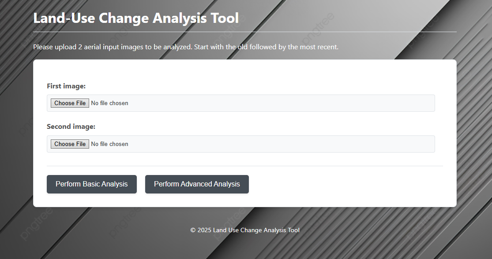
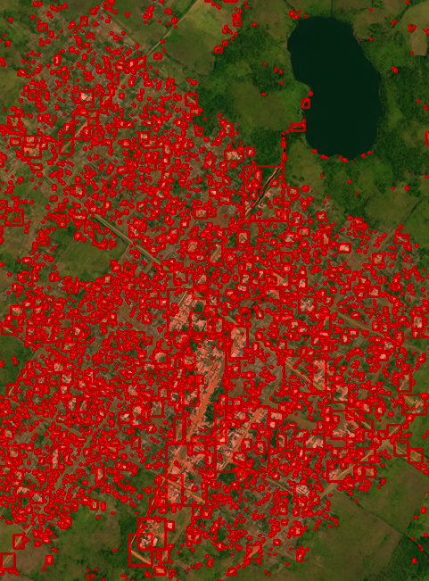
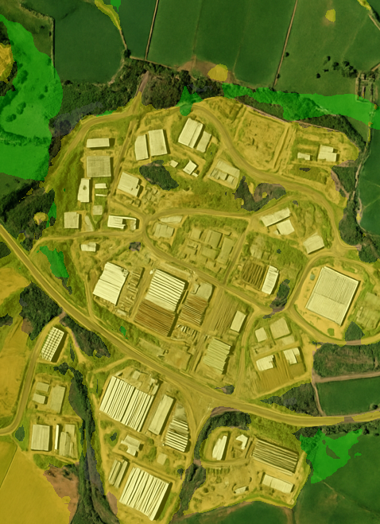

# LAND-USE CHANGE ANALYSIS APP



This Django web application allows users to upload two images of the same geographic area taken at different times and perform different types of analysis to identify and visualize changes.

It provides two analysis options: a basic pixel difference analysis and a more advanced semantic segmentation-based change detection.

## Features

* **Image Upload:** Easily upload two images via a web form.
* **Basic Analysis:**
    * Performs a pixel-by-pixel difference comparison.
    * Applies a threshold to highlight areas with significant pixel value differences.
    * Draws contours and applies a semi-transparent red overlay on detected changes.
    * Calculates the percentage of pixels detected as changed.
* **Advanced Analysis:**
    * Uses a pre-trained deep learning model (Segformer) to perform semantic segmentation on both images.
    * Maps the detailed segmentation results to simplified land use categories (e.g., Buildings, Vegetation, Water, Other).
    * Identifies pixels where the simplified land use category has changed between the two images.
    * Calculates the total percentage of area with simplified category change.
    * Provides a breakdown of changes by transition type (e.g., Vegetation -> Buildings).
    * Generates a visualization map where changed areas are colored according to their *final* simplified category (in the second image).
    * Includes a color legend for the segmentation change map.
* **Two Analysis Options:** Select between Basic and Advanced analysis using distinct buttons on the same form.
* **Model Loading:** The large deep learning model for the Advanced analysis is loaded once per process when the application starts, improving efficiency in production environments.
* **Error Handling:** Basic error messages are displayed to the user, and detailed errors are logged on the server side.

## Prerequisites

Before running the project, ensure you have the following installed:

* Python (3.8 or higher recommended)
* Django (5.2)

## Setup

1. **Clone the repo**
    ```bash
    $ git clone https://github.com/Rabinnnn/land_use_change_analysis.git
    ```

2.  **Navigate to the project directory:**
    ```bash
    $ cd land_use_change_analysis
    ```

3.  **Create a virtual environment** (recommended):
    ```bash
    $ python -m venv land_venv
    ```

4.  **Activate the virtual environment:**
    * On Windows:
        ```bash
        $ .\land_venv\Scripts\activate
        ```
    * On macOS and Linux:
        ```bash
        $ source land_venv/bin/activate
        ```

4.  **Install dependencies:**
    You can install the dependencies using:
    ```bash
    $ pip install -r requirements.txt
    ```
    This might take a while.

    *Note: PyTorch (`torch`) installation can vary based on your system and whether you have a CUDA-enabled GPU. Refer to the [PyTorch installation page](https://pytorch.org/get-started/locally/) for the exact command.*


## Running the Project

5.  Run the development server:
    ```bash
    $ cd land_use_project
    $ python manage.py runserver
    ```
    If this doesn't work try: 
    ```bash
    $ cd land_use_project
    $ python3 manage.py runserver
    ```    
    *Note: On some editors you might notice some parts of the index.html and style.css pages highlighted with some warnings. This is as a result of false-positives produced by the linter. It doesn't affect the app's functionality*

6.  Wait as it loads till it displays a message that looks like this on the console:
"Django version 5.2, using settings 'land_use_project.settings'
Starting development server at http://127.0.0.1:8000/
Quit the server with CTRL-BREAK."

Open your web browser and go to `http://127.0.0.1:8000/` (or the address shown in the console).

## Usage

1.  On the homepage, you will see a form to upload two images.
2.  Click "Choose File" for "Image 1" and select your first image.
3.  Click "Choose File" for "Image 2" and select your second image.
4.  Choose the analysis type:
    * Click **"Perform Basic Analysis"** for the pixel difference method.
    * Click **"Perform Advanced Analysis"** for the segmentation change detection method.
5.  The page will reload, displaying the results relevant to the analysis type you selected, including percentage change, a change map visualization, and additional details or legends depending on the analysis.

*Note: The advanced analysis might take a couple of seconds to complete depending on your system.*

## Recommendations

* The type of input images you upload will determine the ouput. You should aim for high quality images to get the best output. Keep in mind that they should be of the same place over a period of time (e.g 10 years apart). For images taken at very high altitudes, containing small-sized structures that are not easily distinguishable, basic analysis performs better. For images containing relatively large objects that are easily distinguishable advanced analysis works best.
Consider using the images in the sample_input_images directory. Upload the files in ascending order e.g image1 then image 2, to allow proper visualization of changes in the output. 

## Analysis Details

### Basic Analysis (Pixel Difference)

This method is a simple comparison. It calculates the absolute difference between the pixel values of the two images. Areas where the difference exceeds a predefined threshold are considered "changed". Contours and a red overlay highlight these areas. This method is fast but is sensitive to minor variations like lighting changes, shadows, noise, or slight alignment issues, and doesn't understand the semantic content of the images.



### Advanced Analysis (Segmentation Change Detection)

This method utilizes a deep learning model (`nvidia/segformer-b3-finetuned-ade-512-512`) to understand the content of the images.
1.  **Semantic Segmentation:** The model classifies every pixel into categories (from the ADE20K dataset).
2.  **Simplified Mapping:** These detailed categories are mapped to simpler land use types (Buildings, Vegetation, Water, Other) based on the definitions in `views.py`.
3.  **Change Detection:** Changes are detected only where the *simplified* category is different between Image 1 and Image 2.
4.  **Visualization:** The change map highlights these meaningful changes, coloring them according to the simplified category the area *became* in the second image, using the colors defined in `views.py`.
This method provides a more accurate representation of land use change but depends on the accuracy of the pre-trained segmentation model on the specific image types and quality of the simplified category mapping used.



## Model Information

The Advanced Analysis uses the `nvidia/segformer-b3-finetuned-ade-512-512` model from the Hugging Face Transformers library. This is a Segformer model variant 'b3', pre-trained and then fine-tuned on the ADE20K dataset for semantic segmentation tasks, expecting images sized 512x512 (the code handles resizing).

The model is configured to load once per process upon application startup via `AppConfig.ready()`.

## Project Structure

```bash

   land_use_change_analysis/  # project root directory
├── land_venv/                 # Python Virtual Environment (created by `python -m venv`)
│   ├── Include/
│   ├── Lib/
│   ├── Scripts/  # Or 'bin/' on macOS/Linux
│   └── ...
├── land_use_project/
├─     land_use_app/              #  Django app directory
│           ├── migrations/            # Stores database schema migrations (usually empty if no models used)
│           │   └── __init__.py
│           ├── static/                # contains static files like css, js e.t.c 
│           ├── templatetags/          # Custom template tags directory
│           │   ├── __init__.py        # Makes Python treat as a package
│           │   └── encode.py          # custom b64encode filter
│           ├── templates/             # App-specific templates directory
│           │   └── land_use_app/      # Directory named after the app (standard practice)
│           │       └── index.html  # HTML template
│           ├── __init__.py            # Points to AppConfig
│           ├── admin.py               # Django admin configurations
│           ├── apps.py                # custom AppConfig for model loading
│           ├── forms.py               # ImageUploadForm definition
│           ├── models.py              # Database models
│           ├── tests.py               # App tests
│           ├── urls.py                # URL patterns
│           └── views.py               # Django view functions (_perform_basic_analysis, _perform_segmentation_analysis, analyze_images)
├──     land_use_project/          # Main Django project configuration directory
│           ├── __init__.py            # Makes Python treat the directory as a package
│           ├── asgi.py                # ASGI config for async servers
│           ├── settings.py            # Project settings (INSTALLED_APPS, LOGGING, etc.)
│           ├── urls.py                # Project URL patterns (includes app urls)
│           └── wsgi.py                # WSGI config for traditional servers
├──     manage.py                  # Django's command-line utility
├── sample_input_images        # contains input images that you can use to test the functionality of the app
├── README.md                  # Project README file
└── requirements.txt           # List of project dependencies (e.g opencv-python, numpy, Pillow, torch, transformers)

```
## Future Improvements
* Use a more robust model trained on a variety of aerial images for precise detection of several categories of land-use change. 
